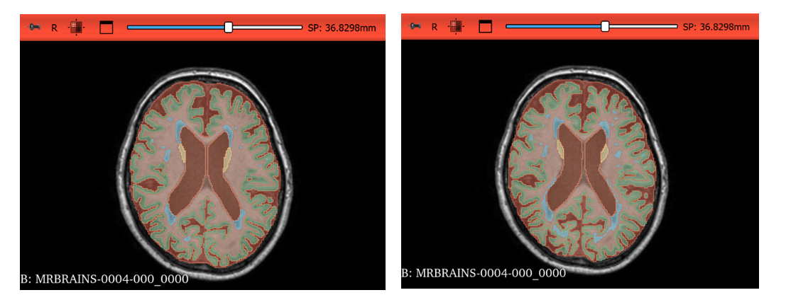

# A Transfer Learning Approach for Multi-Class Brain Tissue Segmentation



Hadar Shklarnik , Shir Klinshtern

## 1. introduction 

This repository contains a deep learning framework for real-time, multi-class brain tissue segmentation, designed to improve the safety and efficacy of Focused Ultrasound (FUS) neurotherapies.

Since precisely annotated medical data is scarce, our solution uses transfer learning:

Pre-training: A model learns foundational brain features from the large BraTS dataset.

Fine-tuning: The model is then specialized for detailed tissue segmentation on the MRBrainS18 dataset.

This two-step approach significantly boosts segmentation accuracy, enabling the precise energy adjustments required for safer and more effective FUS treatments.
## 2. The nnU-Net Framework

The experiments in this project were conducted using **nnU-Net** https://github.com/MIC-DKFZ/nnUNet, an automated framework for designing and training U-Net–based models for medical image segmentation. Its strength lies in self-configuring hyperparameters and architecture based on dataset properties. While automated, nnU-Net is fully extensible, allowing for customized trainers, loss functions, or data augmentations.

### 2.1. Self-Configuring Pipeline

Upon analyzing a new dataset, nnU-Net automatically determines a complete set of "plans" for preprocessing, model architecture, and training. This includes critical hyperparameters such as resampling, normalization, network architecture, patch size, and batch size.

### 2.2. The U-Net Architecture

The core of nnU-Net is the **U-Net**, a fully convolutional network characterized by its symmetric encoder-decoder structure with skip connections. This allows the network to combine high-level semantic information from the decoder with low-level, high-resolution spatial information from the encoder, enabling precise localization.

## 4. Methodology

### 4.1. Datasets

* **Source Dataset (Pre-training):** **BraTS 2025** - Comprises ~1000 multi-modal MRI scans of glioma patients.
* **Target Dataset (Fine-tuning):** **MRBrainS18** - Consists of 30 multi-modal MRI scans with expert annotations for 10 brain structures. The data was split into 23 images for training and 7 for testing.

### 4.2. Transfer Learning Protocol

The experiment follows a two-phase protocol using a 2D nnU-Net configuration.

1.  **Phase 1: Pre-training:** A model is trained on the BraTS dataset to learn general anatomical and pathological features.
2.  **Phase 2: Fine-tuning:** The model is initialized with the pre-trained weights and then trained on the MRBrainS18 dataset to specialize in multi-class tissue segmentation.

### 4.3. Hyperparameter Configuration

The following key hyperparameters were automatically determined by nnU-Net for the `2d` configuration used in the fine-tuning phase.

| Hyperparameter    | Value                                         | Description                                                          |
| ----------------- |-----------------------------------------------| -------------------------------------------------------------------- |
| **Configuration** | `2d`                                          | The model operates on 2D slices of the 3D volumes.                   |
| **Batch Size** | 2                                             | Number of 2D patches processed in each training step.                |
| **Patch Size** | `[192, 160]`                                  | The dimensions (in pixels) of the 2D patches extracted for training. |
| **Target Spacing**| `[1.0, 1.0]` mm                               | All images are resampled to this isotropic in-plane resolution.      |
| **Normalization** | Z-Score                                       | Per-channel normalization (mean subtraction, division by std).       |
| **Optimizer** | SGD                                           | SGD inital learning rate was set to 0.1, momentum of 0.99                                        |
| **Scheduler** | PolyLRScheduler                               | Polynomial learning rate decay.<br/>                                      |
| **Epochs** | ~150 for the pre-training ~60 for fine-tuning | Training was stopped once the validation Dice score plateaued, occurring at ~150 epochs for pre-training and ~60 for fine-tuning.<br/> 

Ths loss function used is the **Dice loss**, which is particularly effective for imbalanced multi-class segmentation tasks.
### 4.4 Loss

We combine **Soft Dice** (optimizes region overlap; handles imbalance) with **Cross-Entropy** (stable gradients). Default: $\lambda_{\text{Dice}}=\lambda_{\text{CE}}=0.5$.

**Equations** (softmax probs $\hat y$, one-hot targets $y$; $K$ classes; $N$ pixels):
```math
\mathrm{Dice}_k = \frac{2\sum_i \hat y_{ik}y_{ik}+\epsilon}{\sum_i \hat y_{ik}+\sum_i y_{ik}+\epsilon}, \qquad \mathcal{L}_{\mathrm{Dice}} = 1 - \frac{1}{K}\sum_{k=1}^K \mathrm{Dice}_k
```
```math
\mathcal{L}_{\mathrm{CE}} = -\frac{1}{N}\sum_{i=1}^N \sum_{k=1}^K y_{ik}\log \hat y_{ik}
```
```math
\mathcal{L} = \lambda_{\mathrm{Dice}}\mathcal{L}_{\mathrm{Dice}} + \lambda_{\mathrm{CE}}\mathcal{L}_{\mathrm{CE}}
```

## 5. Results and Discussion

### 5.1. Pre-training

The model was pre-trained on the BraTS dataset until it reached a **Dice score of 0.76** on the test set, which was deemed sufficient for transfer learning.
Data was split into 80% traning and 20% validation, with the training set containing 800(Which was split into 80% train and 20% validation) images and the test set containing 200 images. The pre-training process took approximately 150 epochs to converge.

### 5.2. Fine-tuning Results

We explored three fine-tuning strategies. The final results on the test set are summarized below. The mean Dice score is calculated after excluding the 'Infarction' label, which was underrepresented in the training data.

| Approach                                     | Dice Mean (Excluding Infarction) |
|----------------------------------------------|----------------------------------|
| Freezing the entire encoder                  | 0.8528                           |
| Freezing only the first three encoder layers | **0.8610**                       |
| Fine-tune the whole network                  | **0.8611**                       |

The results confirm a strong generalization across the remaining labels. The most effective strategies were complete network fine-tuning and freezing the initial three encoder layers.
**</br>The segementation generated for each approach providded in the `results` directory along with an evaluation report for each approach.**

## 6. Future Work and Recommendations

1.  **Transition to 3D Volumetric Model:** Leverage the `3d_fullres` nnU-Net configuration to incorporate inter-slice spatial context, which requires careful preprocessing to harmonize spacing between datasets.
2.  **Complete 5-Fold Cross-Validation:** Implement a full 5-fold cross-validation to enhance the robustness and reliability of the final results.
3.  **Augmentation Strategy:** Systematically investigate advanced data augmentation techniques if performance plateaus.

## 7. Conclusion

This project successfully establishes a formal transfer learning pipeline for medical image segmentation to enable FUS control. 

## 8. How to Use This Project

### Installation

1.  Clone the repository:
    ```bash
    git clone [https://github.com/shirkl764/nnUNet_Project.git](https://github.com/Hadgit-tech/nnUNet_BrainTissue_SEG.git)
    cd nnUNet_Project
    ```
2.  Install the required dependencies and nnU-Net:
    ```bash
    pip install -e .
    ```

### Dataset Setup

1.  Download the BraTS and MRBrainS18 datasets.
    * **BraTS 2025:** [BraTS 2025 Dataset](https://www.synapse.org/#!Synapse:syn25808581/wiki/605020)
    * **MRBrainS18:** [MRBrainS18 Dataset](https://mrbrains18.isi.uu.nl/)
3. Convert the datasets to the nnU-Net format using the provided scripts(Under "data_formatting" directory) or nnU-Net's built-in tools.
4. Set the environment variables for nnU-Net:
    ```bash
    export nnUNet_raw="/path/to/nnUNet_raw"
    export nnUNet_preprocessed="/path/to/nnUNet_preprocessed"
    export nnUNet_results="/path/to/nnUNet_results"
    ```

### Training and Inference

1.  **Pre-training on BraTS:**
    ```bash
    nnUNetv2_train [Dataset_ID_BraTS] 2d all
    ```
2.  **Fine-tuning on MRBrainS18:**
    ```bash
    nnUNetv2_train [Dataset_ID_MRBrainS] 2d all -pretrained_weights /path/to/BraTS/model/checkpoint.pth
    ```
3.  **Inference:**
    ```bash
    nnUNetv2_predict -i /path/to/input/images -o /path/to/output/segmentations -d [Dataset_ID_MRBrainS] -c 2d -f 0
    ```
3.  **Evaluation:**
    ```bash
    nnUNetv2_evaluate_folder /path/to/ground_truth_segmentations  /path/to/sementation_perdication 
    ```
### Using plans genrated by uuNet
To plans used for training are stored in the folder '\nnUNet_preprocessed'
<br/>Due to the large size of the weights, they are not included in this repository and will be sent upon request. 

## 9. Adjusting nnUnet  

The project's code is designed to be modular and extensible, allowing for easy adjustments to the nnU-Net configuration. Below are the key steps to modify the nnU-Net settings, such as freezing layers or changing the optimizer.

**Changing optimizer and scheduler:**<br/>
The optimizer and schedular is set in the `nnUNetTrainer` class, which can be found in the `nnUNet/nnunetv2/training/nnUNetTrainer/nnUNetTrainer.py`file. To change the optimizer, you can modify the `configure_optimizers` method within this class.
You can comment out the differnt options in the `configure_optimizers` method to change the optimizer/schedular.

<br/>**Freezing layers:**<br/>
To freeze specific layers in the encoder, you can modify the `nnUNetTrainer` class. The freezing logic is  implemented in the `initialize` method. You can comment out the conditions to freeze certain layers based on your requirements.


## 10. References

[1] Isensee, F., Jaeger, P. F., Kohl, S. A., Petersen, J., & Maier-Hein, K. H. (2021). nnU-Net: a self-configuring method for deep learning-based biomedical image segmentation. *Nature methods, 18*(2), 203-211.
<br/>[2] https://github.com/MIC-DKFZ/nnUNet
